<div align="center">

<picture>
  <source media="(prefers-color-scheme: dark)" srcset="assets/header.svg">
  
</picture>

<br>

<marquee width="88%" direction="left" scrollamount="3" scrolldelay="30">
  ▶ BharathrajN2004 · 5h ago  │  ▶ su-payment-management · 9h ago  │  ▶ admin-dashboard · 9h ago  │  ▶ new_picker_app · 9h ago  │  ▶ React.3.InqubateQRAdmin · 10h ago  │  ▶ Flutter.4.DomainExpertiser · 10h ago  │  ▶ Flutter.2.1.ExpenseTracker · 10h ago  │  ▶ Tauri.React.Flutter.Al-ML...1.Decoder · 10h ago  │  ▶ React.Flutter.1.Handler · 10h ago  │  ▶ Flutter.IOT.Node.1.WomenSafety · 10h ago

</marquee>

<br>

```
🤖  Full-stack. Flutter · Go · TypeScript · Swift.
    I build things that ship.
```

---

<details open>
<summary><b>▸ $ code-rules</b></summary>

```
Architecture that bends to the problem, not the other way.
```

</details>

<details>
<summary><b>▸ $ arch-patterns</b></summary>

```
Boundaries where change lives. Otherwise, none.
```

</details>

<details>
<summary><b>▸ $ sys-design</b></summary>

```
Degrade. Never die. Visibility before velocity.
```

</details>

<details>
<summary><b>▸ $ scrapuncle --work</b></summary>

```
┌────────────────┬─────────────────┬──────────────────┐
│  CUSTOMER APP  │  OPERATIONS     │  CORE SERVICES   │
│  Flutter/Dart  │  Flutter/Dart   │  Go / TypeScript │
│  Consumer      │  Internal ops   │  Backend infra   │
└────────────────┴─────────────────┴──────────────────┘

▸ Full-stack ownership. Mobile to infra.
▸ Private work — architecture gists only.
```

</details>

<details>
<summary><b>▸ $ portfolio --show</b></summary>

<br>

#### 📊 MARKET

```
SYM    │ PROJECT              │ TECH        │ PRICE │ CHG  │ STAT
───────┼──────────────────────┼─────────────┼───────┼──────┼─────
$FLUTT  │ Flutter.12.RedHat_Ad │ Dart       │ ★ 2   │ ▸ 0  │ 🟣
$NADAI  │ nadai_app            │ Dart       │ ★ 1   │ ▸ 0  │ 🔵
$FLUTT  │ Flutter.7.BatteryInd │ Dart       │ ★ 0   │ ▸ 0  │ 🟣
$QUANT  │ Quantathon_1.0       │ JavaScript │ ★ 0   │ ▸ 0  │ 🟣
$MISSI  │ Mission_O2           │ Dart       │ ★ 0   │ ▸ 0  │ 🟣
$SIH_2  │ SIH_2024             │ TypeScript │ ★ 0   │ ▸ 0  │ 🟣
$POND-  │ pond-quality-server  │ JavaScript │ ★ 0   │ ▸ 0  │ 🟣
$PLAYP  │ PlayPal              │ C++        │ ★ 0   │ ▸ 0  │ 🟣
```

#### 📋 KANBAN

```
🟢 ACTIVE                                  🔵 STABLE                                  🟣 SHIPPED                                
                                                                                                                                      
│ BharathrajN200 │ Shell       │ today   │ │ scrapuncle_das │ TypeScript  │ 31d ago  │ │ psqlToFirebase │ JavaScript  │ 191d ago  │
│ su-payment-man │ TypeScript  │ today   │ │ su-backend     │ Go          │ 35d ago  │ │ su-user-fronte │ TypeScript  │ 250d ago  │
│ admin-dashboar │ TypeScript  │ today   │ │ nadai_app      │ Dart        │ 44d ago  │ │ coupon-managem │ TypeScript  │ 270d ago  │
│ new_picker_app │ Dart        │ today   │ │ me             │ TypeScript  │ 51d ago  │ │ scrapuncle_adm │ TypeScript  │ 308d ago  │
│ React.3.Inquba │ JavaScript  │ today   │ │ coupon-dashboa │ TypeScript  │ 78d ago  │ │ su-communicati │ JavaScript  │ 309d ago  │
│ Flutter.4.Doma │ N/A         │ today   │ │ Scrap_Bot      │ Python      │ 78d ago  │ │ speech-to-text │ Python      │ 330d ago  │
│ Flutter.2.1.Ex │ N/A         │ today   │ │ Flutter.14.spl │ Dart        │ 102d ago  │ │ SU_Campaign    │ JavaScript  │ 349d ago  │
│ Tauri.React.Fl │ N/A         │ today   │ │ TShirt_logo_de │ Python      │ 106d ago  │ │ cupon_assign_m │ Jupyter Notebook│ 350d ago  │
│ React.Flutter. │ N/A         │ today   │ │ Weighing-Machi │ Python      │ 112d ago  │ │ Nodejs_metaFor │ JavaScript  │ 359d ago  │
│ Flutter.IOT.No │ N/A         │ today   │ │ Anomaly_Detect │ Jupyter Notebook│ 114d ago  │ │ Summary_Model  │ Jupyter Notebook│ 367d ago  │
│ custom_bottom_ │ N/A         │ today   │ │ su-scripts     │ Python      │ 137d ago  │ │ Gemini_Weight_ │ Jupyter Notebook│ 369d ago  │
│ LiveInLab-Deco │ JavaScript  │ today   │ │ redirect       │ TypeScript  │ 142d ago  │ │ User_Chatbot   │ Python      │ 370d ago  │
│ KH002_Splitit  │ Dart        │ today   │ │ su-communicati │ TypeScript  │ 156d ago  │ │ Object_Detect_ │ Python      │ 377d ago  │
│ Flutter.12.Red │ Dart        │ today   │ │ docs           │ JavaScript  │ 169d ago  │ │ picker_app     │ Dart        │ 385d ago  │
│ Flutter-Webina │ Dart        │ today   │ │ Psql_to_fireba │ JavaScript  │ 169d ago  │ │ Image_Classify │ Jupyter Notebook│ 385d ago  │
│ user_managemen │ Dart        │ today   │                                                │ whatsappWorker │ JavaScript  │ 392d ago  │
│ StudioV_video_ │ Dart        │ today   │                                                │ interakt_api   │ TypeScript  │ 395d ago  │
│ Microservice_v │ Go          │ today   │                                                │ Address_To_Coo │ N/A         │ 397d ago  │
│ EJS.1.TeacherV │ EJS         │ today   │                                                │ Flutter.12.Red │ Dart        │ 400d ago  │
│ React.2.Domain │ JavaScript  │ today   │                                                │ consumer_app   │ Dart        │ 406d ago  │
│ React.1.Teache │ JavaScript  │ today   │                                                │ awsLambda      │ JavaScript  │ 408d ago  │
│ student_projec │ Dart        │ today   │                                                │ firebase_rpick │ JavaScript  │ 408d ago  │
│ nutpam24       │ JavaScript  │ today   │                                                │ routes         │ Python      │ 429d ago  │
│ Dopeshield     │ Dart        │ today   │                                                │ ws             │ JavaScript  │ 439d ago  │
│ SIH_avalanche_ │ JavaScript  │ today   │                                                │ scrapuncle_war │ Dart        │ 448d ago  │
│ Flutter.11.Dro │ N/A         │ today   │                                                │ ORION_server   │ Go          │ 464d ago  │
│ Flutter.10.SIH │ C++         │ today   │                                                │ ORION_Bun_serv │ TypeScript  │ 469d ago  │
│ Flutter.9.IC_S │ Dart        │ today   │                                                │ exotel_to_noti │ Python      │ 473d ago  │
│ Flutter.8.Phot │ C++         │ today   │                                                │ prisma_to_fire │ TypeScript  │ 484d ago  │
│ Flutter.6.2.Sp │ Dart        │ today   │                                                │ scrapuncle_flu │ C++         │ 490d ago  │
│ Flutter.6.Spla │ Dart        │ today   │                                                │ ORION_user     │ Dart        │ 515d ago  │
│ Flutter.5.Inve │ C++         │ today   │                                                │ TEDx-SIT       │ TypeScript  │ 526d ago  │
│ Flutter.3.Even │ Dart        │ today   │                                                │ Flutter.15.Stu │ Dart        │ 590d ago  │
│ Flutter.2.2.Ex │ Dart        │ today   │                                                │ Flutter.13.Piw │ C++         │ 643d ago  │
│ warehouse_app  │ Dart        │ 2d ago  │                                                │ FindWho        │ C++         │ 649d ago  │
│ Scrapuncle_CS_ │ Dart        │ 2d ago  │                                                │ PlayPal        │ C++         │ 660d ago  │
│ scrapuncle-loc │ TypeScript  │ 3d ago  │                                                │ pond-quality-s │ JavaScript  │ 674d ago  │
│ new_consumer_a │ Dart        │ 5d ago  │                                                │ SIH_2024       │ TypeScript  │ 683d ago  │
│ Scrapuncle_dia │ Dart        │ 14d ago  │                                                │ Mission_O2     │ Dart        │ 777d ago  │
│ macmonitor     │ Swift       │ 23d ago  │                                                │ Quantathon_1.0 │ JavaScript  │ 1063d ago  │
│ scrapuncle-pic │ TypeScript  │ 23d ago  │                                                │ Flutter.7.Batt │ Dart        │ 1097d ago  │
│ ScrapUncle-Mic │ Go          │ 23d ago  │                                                                                             
```

</details>

<details>
<summary><b>▸ $ blog --queue</b></summary>

```
📝  Clean Arch in Flutter
    ✅ domain/ isolation     ❌ boilerplate cost

📝  Go Microservices
    ✅ DI by hand            ❌ framework magic

📝  Firebase: The Bait & Switch
    ✅ week 0 prototype      ❌ week 52 lock-in

📝  Flutter Perf at Scale
    ✅ lazy everything       ❌ monolith widget tree

📍  Publishing soon — Substack / blog site
```

</details>

---

<picture>
  <source media="(prefers-color-scheme: dark)" srcset="assets/lang-bars.svg">
  
</picture>

<br>


<br>


---

```
┌─ CONNECT ──────────────────────────────────────────┐
│                                                     │
│      📧  bharathrajn2004@gmail.com                  │
│      🐙  github.com/BharathrajN2004                 │
│      💼  linkedin.com/in/bharathraj-n               │
│                                                     │
└─────────────────────────────────────────────────────┘
```

```
$ █  [synced: 16 Jul 2026 19:13 UTC]
```

</div>
